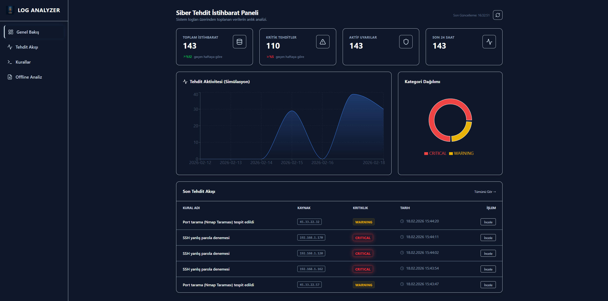
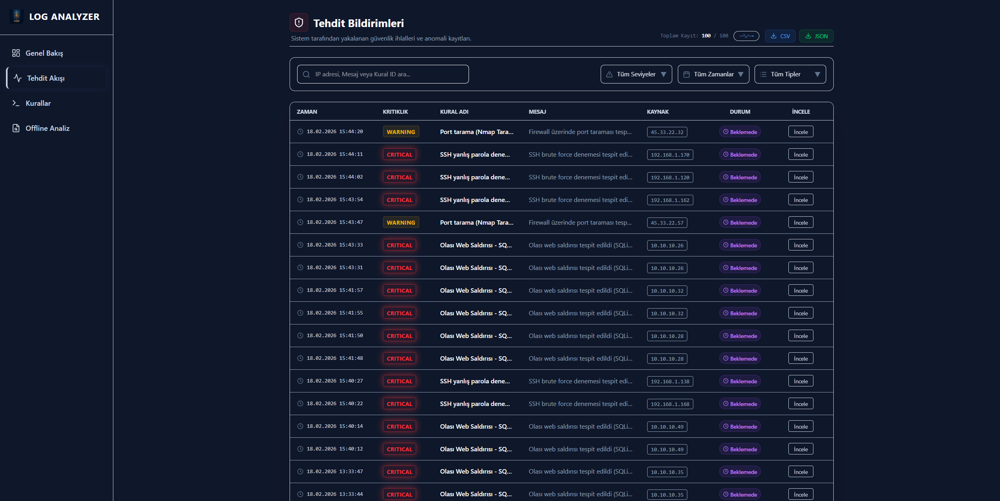
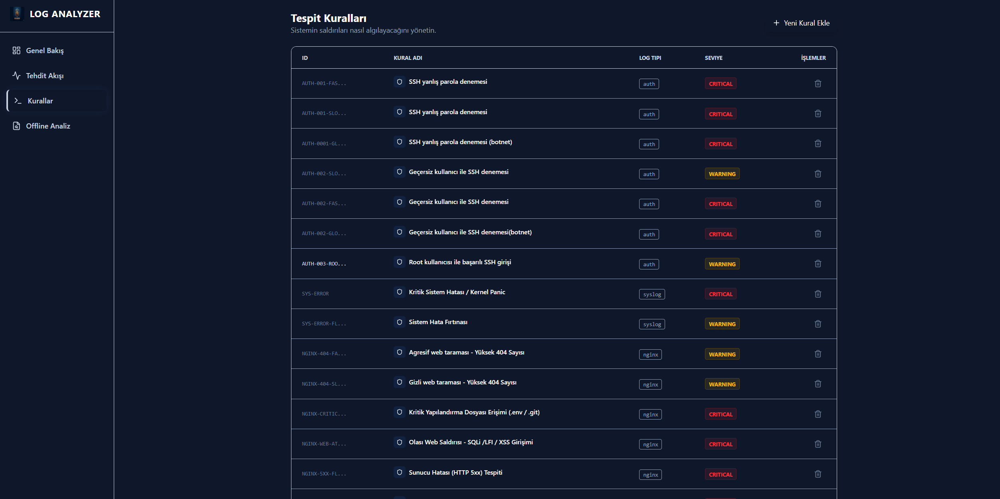
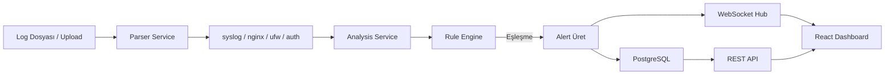
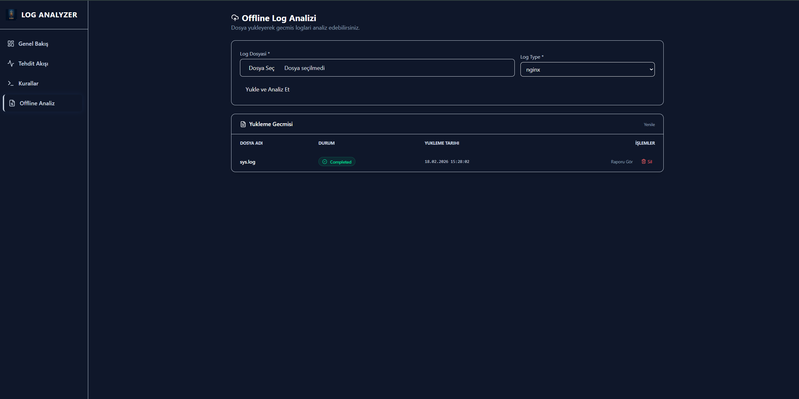

<div align="center">

# 🛡️ Log Analyzer

### Gerçek Zamanlı Güvenlik Log Analizi ve Tehdit Tespit Platformu

[](https://opensource.org/licenses/MIT)
[](https://golang.org/)
[](https://reactjs.org/)
[](https://www.postgresql.org/)
[](https://www.docker.com/)
[](https://grafana.com/)



*Syslog, Nginx, UFW ve Auth loglarını gerçek zamanlı analiz eden, kural tabanlı alarm üreten ve tam izlenebilirlik sunan üretim kalitesinde güvenlik platformu.*

[🚀 Hızlı Başlangıç](#-hızlı-başlangıç) • [📚 Mimari](#️-mimari-ve-tasarım) • [✨ Özellikler](#-temel-özellikler) • [🛠️ Kurulum](#-kurulum-adımları) • [📡 API](#-api-referansı)

</div>

---

## 📋 İçindekiler

- [Proje Hakkında](#-proje-hakkında)
- [Temel Özellikler](#-temel-özellikler)
- [Sistem Mimarisi](#️-mimari-ve-tasarım)
- [Teknoloji Stack](#️-teknoloji-stacki)
- [Kurulum](#-kurulum-adımları)
- [Kullanım](#-kullanım)
- [API Referansı](#-api-referansı)
- [Kural Motoru](#-kural-motoru)
- [Karşılaşılan Problemler](#-karşılaşılan-problemler-ve-çözümler)
- [Roadmap](#-roadmap)
- [Lisans](#-lisans)

---

## 🎯 Proje Hakkında

**Log Analyzer**, Linux sistem loglarını (syslog, nginx access logs, UFW güvenlik duvarı logları, auth logs) gerçek zamanlı olarak izleyen, YAML tabanlı kural motoru ile otomatik alarm üreten ve tüm bu verileri modern bir React dashboard üzerinden görselleştiren uçtan uca bir **güvenlik izleme platformudur**.

### 🎯 Proje Hedefi

Güvenlik analistleri ve sistem yöneticileri için:
- 🔍 **Çoklu log kaynağını** tek merkezden izleme
- ⚡ **Gerçek zamanlı tehdit tespiti** ve anında bildirim
- 📊 **Görselleştirme ve istatistik** araçları
- 📁 **Offline toplu analiz** ve raporlama
- 🔁 **Alert review akışı** ile alarm yönetimi
- 📤 **CSV / JSON export** ile raporlama desteği

---

## ✨ Temel Özellikler

### 🔬 Akıllı Log Parsing
- **4 farklı parser**: Syslog, Nginx Access Log, UFW Firewall Log, Auth Log
- **Tail-based** gerçek zamanlı dosya izleme (`nxadm/tail`)
- **Yapısal veri çıkarma**: IP adresi, kullanıcı adı, HTTP metodu, port numarası
- **Timestamp normalizasyonu** ve timezone desteği

### 🚨 Kural Tabanlı Alarm Motoru
- **YAML tabanlı** kural tanımı — kod yazmadan yeni kural ekleme
- **Keyword ve Regex** eşleştirme modları
- **Threshold sistemi**: Zaman penceresi içinde N olay = Alarm
- **4 Seviye**: `INFO`, `WARNING`, `HIGH`, `CRITICAL`
- **Global kural desteği**: IP bağımsız botnet tespiti
- **Regex önbelleği**: Yüksek hacimli loglarda performans optimizasyonu

### ⚡ Gerçek Zamanlı Dashboard
- **WebSocket** bağlantısı ile anında alarm akışı
- **İnteraktif stat kartları**: Toplam, Kritik, İncelenmemiş alert sayıları
- **Günlük trend grafikleri** (Recharts)
- **Canlı alert tablosu** — yeni alertler sayfayı yenilemeden gelir
- **Durum rozetleri** ile kritiklik görselleştirmesi

### 📁 Offline Analiz
- **Dosya yükleme** ile geçmiş log analizi
- **Job bazlı** analiz takibi ve durum izleme
- **Offline alertler** canlı akıştan izole — karışma yok

### 🔁 Alert Yönetimi



- **Review / Unreview** — her alert incelendi mi takibi
- **Anlık UI güncellemesi** (optimistic update)
- **Veritabanı kalıcılığı** — review durumu persist ediliyor
- **CSV & JSON export** — tarihli dosya adı ile otomatik indirme

### 🔧 Kural Yönetimi



- UI üzerinden **yeni kural ekleme ve silme**
- Kural değişikliğinde **hot reload** — servis yeniden başlatılmıyor
- Hem YAML seed hem **veritabanı kaynaklı** kural yönetimi

### 📊 Tam İzlenebilirlik (Observability)
- **Prometheus** ile metrik toplama
- **Grafana** ile dashboard ve görselleştirme
- **Loki + Promtail** ile yapısal log aggregation
- **Zerolog** ile JSON formatında yapısal backend loglama

---

## 🏗️ Mimari ve Tasarım

### Sistem Mimarisi

```
┌──────────────────────────────────────────────────────────────────┐
│                      🌐 FRONTEND (React)                         │
│          Dashboard • Alerts • Offline Jobs • Rules               │
└────────────────────────────┬─────────────────────────────────────┘
                             │ REST API + WebSocket
                             ▼
┌──────────────────────────────────────────────────────────────────┐
│                   🔌 BACKEND (Go / Gin)                          │
│   ┌─────────────┐  ┌──────────────┐  ┌──────────────────────┐   │
│   │ API Handlers│  │ WebSocket Hub│  │   Analysis Service   │   │
│   └─────────────┘  └──────────────┘  └──────────┬───────────┘   │
│                                                  │               │
│   ┌──────────────────────────────────────────────▼───────────┐   │
│   │                    Parser Service                        │   │
│   │   syslog │ nginx │ ufw │ authlog │ time_parser           │   │
│   └──────────────────────────────────────────────────────────┘   │
│                                                                   │
│   ┌──────────────────────────────────────────────────────────┐   │
│   │               Rule Engine (YAML + DB)                    │   │
│   │   keyword match │ regex match │ threshold │ severity     │   │
│   └──────────────────────────────────────────────────────────┘   │
└────────────────────────────┬─────────────────────────────────────┘
                             │ GORM
                             ▼
┌──────────────────────────────────────────────────────────────────┐
│                   💾 DATABASE (PostgreSQL)                        │
│         alerts │ rules │ analysis_jobs │ log_entries             │
└──────────────────────────────────────────────────────────────────┘

┌───────────────────────────────────────────────────────────────┐
│                  📊 OBSERVABILITY STACK                        │
│   Promtail → Loki → Grafana      Prometheus → Grafana         │
└───────────────────────────────────────────────────────────────┘
```

### 📦 Sistem Bileşenleri

| Bileşen | Katman | Teknoloji | Görev |
|---------|--------|-----------|-------|
| **backend** | İş Mantığı | Go 1.24 + Gin | Log parse, kural motoru, API, WebSocket |
| **frontend** | Sunum | React 19 + Vite | Dashboard, alert yönetimi, kural UI |
| **db** | Veri Saklama | PostgreSQL 15 | Alert, kural ve job kalıcılığı |
| **loki** | Log Aggregation | Grafana Loki | Yapısal log depolama |
| **promtail** | Log Shipper | Grafana Promtail | Container loglarını Loki'ye gönderir |
| **prometheus** | Metrik Toplama | Prometheus | Sistem metriklerini toplar |
| **grafana** | Görselleştirme | Grafana | Metrik ve log dashboardları |

### 🔄 Veri Akış Döngüsü



---

## 🛠️ Teknoloji Stacki

### Backend

<div align="center">

| Teknoloji | Versiyon | Kullanım Alanı |
|-----------|----------|----------------|
|  | 1.24+ | Ana backend dili |
|  | 1.11+ | HTTP web framework |
|  | 15 | İlişkisel veritabanı |
|  | 1.31+ | ORM ve auto-migration |

</div>

**Go Kütüphaneleri:**
- `github.com/gin-gonic/gin` — HTTP framework ve routing
- `gorm.io/gorm` + `gorm.io/driver/postgres` — ORM
- `github.com/gorilla/websocket` — WebSocket sunucusu
- `github.com/nxadm/tail` — Gerçek zamanlı log dosyası takibi
- `github.com/rs/zerolog` — Yapısal JSON loglama
- `gopkg.in/yaml.v3` — YAML kural dosyası okuma
- `github.com/google/uuid` — Benzersiz ID üretimi

### Frontend

<div align="center">

| Teknoloji | Versiyon | Kullanım Alanı |
|-----------|----------|----------------|
|  | 19.0+ | UI framework |
|  | 7.0+ | Build tool ve dev server |
|  | 4.0+ | Utility-first CSS |
|  | 3.0+ | Grafik ve veri görselleştirme |

</div>

**Frontend Kütüphaneleri:**
- `axios` — HTTP istemcisi
- `react-router-dom` — Sayfa yönlendirme
- `lucide-react` — İkon seti
- `date-fns` — Tarih formatlama
- `clsx` + `tailwind-merge` — Koşullu class yönetimi

### DevOps & Observability

<div align="center">


</div>

---

## 🚀 Hızlı Başlangıç

### Ön Gereksinimler

```
- Docker Desktop veya Docker Engine (20.10+)
- Docker Compose (2.0+)
- Git
- 4GB+ RAM (tüm servisler için)
```

### ⚡ Kurulum Adımları

1️⃣ **Repository'yi klonlayın**
```bash
git clone https://github.com/MustafaTalhadgn/log-analyzer.git
cd log-analyzer
```

2️⃣ **Tüm servisleri başlatın**
```bash
docker compose up --build -d
```

3️⃣ **Servislerin sağlıklı olduğunu doğrulayın**
```bash
docker compose ps
```

4️⃣ **Örnek log üretin (opsiyonel)**
```bash
python generate_logs.py
```

5️⃣ **Uygulamaya erişin**

| Servis | URL | Açıklama |
|--------|-----|----------|
| 🌐 Dashboard | http://localhost:3000 | React UI |
| 📡 Backend API | http://localhost:8080 | REST API + WebSocket |
| 📊 Grafana | http://localhost:3001 | Monitoring (admin/admin) |
| 🔥 Prometheus | http://localhost:9090 | Metrikler |
| 📦 Loki | http://localhost:3100 | Log aggregation |
| 🗄️ PostgreSQL | localhost:5432 | Veritabanı |

---

## 💻 Kullanım

### 1. Dashboard


Ana sayfada şunları görebilirsiniz:
- 📊 **Stat Kartları**: Toplam alert, kritik alert, incelenmemiş alert sayısı
- 📈 **Günlük Trend Grafiği**: Son 7 günlük alert dağılımı
- ⚡ **Canlı Alert Akışı**: WebSocket ile anlık gelen yeni alarmlar
- 🎨 **Kritiklik Renk Kodları**: CRITICAL (kırmızı), HIGH (turuncu), WARNING (sarı), INFO (mavi)

### 2. Tehdit Akışı ve Alert Yönetimi


Alert listesinde:
- 🔍 **Tüm alertleri** kritikliğe, log tipine ve kaynak IP'ye göre görüntüleme
- ✅ **Review / Unreview**: Her alert için inceleme durumunu işaretle
- 📥 **Export**: Tüm alertleri CSV veya JSON olarak indir
- 🏷️ **Durum Rozeti**: İncelendi / Beklemede görsel ayrımı

### 3. Offline Analiz



Geçmiş logları analiz etmek için:
```
1. "Offline Analiz" sayfasına gidin
2. Log dosyasını (syslog, nginx, ufw, auth formatı) yükleyin
3. Analiz job'unun tamamlanmasını bekleyin
4. Job'a ait alertleri filtreli görüntüleyin
```

### 4. Kural Yönetimi


UI üzerinden kural yönetimi:
- 📋 **Tüm kuralları** listele — ID, açıklama, log tipi, eşik ve seviye
- ➕ **Yeni kural ekle** — form ile hızlıca yeni kural tanımla
- 🗑️ **Kural sil** — aktif kuralı kaldır ve motoru güncelle
- 🔄 **Hot reload** — kural değişikliği anında devreye girer

---

## 📡 API Referansı

### Alert Endpoint'leri

```http
GET    /api/alerts                          # Tüm canlı alertleri getir
GET    /api/stats                           # Genel istatistikler
GET    /api/stats/daily                     # Günlük alert sayıları
PUT    /api/alerts/:alert_id/review         # Alerty incelendi olarak işaretle
PUT    /api/alerts/:alert_id/unreview       # İnceleme işaretini kaldır
GET    /api/alerts/export/:format           # CSV veya JSON export (format: csv|json)
```

### Offline Analiz Endpoint'leri

```http
POST   /api/upload                          # Log dosyası yükle ve analiz başlat
GET    /api/jobs                            # Tüm analiz job'larını listele
DELETE /api/jobs/:job_id                    # Job ve ilgili alertleri sil
```

### Kural Endpoint'leri

```http
GET    /api/rules                           # Tüm kuralları listele
POST   /api/rules                           # Yeni kural ekle
DELETE /api/rules/:id                       # Kural sil
```

### WebSocket

```
GET    /ws                                  # Gerçek zamanlı alert akışı
```

**Örnek Alert Response:**
```json
{
  "id": "f3a2c1b0-...",
  "rule_id": "AUTH-001-FAST",
  "rule_name": "SSH Brute Force",
  "severity": "CRITICAL",
  "message": "SSH brute force denemesi tespit edildi",
  "source_ip": "192.168.1.50",
  "log_type": "auth",
  "reviewed": false,
  "created_at": "2026-02-18T14:00:00Z"
}
```

**Export Örnekleri:**
```bash
# CSV indir
curl http://localhost:8080/api/alerts/export/csv -o alerts.csv

# JSON indir
curl http://localhost:8080/api/alerts/export/json -o alerts.json
```

---

## 🔧 Kural Motoru

Kural tanımları `Backend/rules.yaml` dosyasından seed edilir ve veritabanında yönetilir.

**Kural Yapısı:**
```yaml
- id: AUTH-001-FAST
  description: "SSH yanlış parola denemesi (hızlı)"
  log_type: auth
  match:
    type: keyword         # keyword veya regex
    value: "Failed password"
  extract:
    ip_regex: "from\\s+([0-9.]+)"
    user_regex: "for\\s+(?:invalid user\\s+)?([a-zA-Z0-9_-]+)"
  threshold:
    count: 5              # 60 saniyede 5 deneme = ALARM
    within_seconds: 60
  severity: CRITICAL
  alert_message: "SSH brute force denemesi tespit edildi"
```

**Desteklenen Log Tipleri:**

| Log Tipi | Örnek Kural ID'leri | Tespit Edilen Tehditler |
|----------|---------------------|-------------------------|
| `auth` | AUTH-001, AUTH-002, AUTH-003 | SSH brute force, invalid user, root login |
| `nginx` | NGINX-404, NGINX-WEB-ATTACK | Port tarama, SQLi, LFI, XSS, 5xx flood |
| `ufw` | UFW-SSH, UFW-PORT-SCAN | Firewall ihlalleri, port tarama |
| `syslog` | SYS-ERROR, SYS-ERROR-FLOOD | Kernel panic, OOM killer, hata fırtınası |

---

## 🐛 Karşılaşılan Problemler ve Çözümler

### Problem 1: Canlı ve Offline Alert Karışması
**Sorun:** Offline analiz alertleri canlı dashboard'u kirletiyordu.
**Çözüm:**
- Alert entity'e `AnalysisJobID *string` nullable foreign key eklendi
- Canlı alertler `AnalysisJobID IS NULL` ile filtreleniyor
- Offline alertler yalnızca kendi job detay sayfasında görünüyor
- **Sonuç:** Tam izolasyon, veri karışması %0

### Problem 2: Regex Performansı
**Sorun:** Yüksek hacimli log akışında her satır için regex derleme gecikme yaratıyordu.
**Çözüm:**
- `AnalysisService` içinde `matchRegexCache` ve `extractRegexCache` map'leri eklendi
- Regex bir kez derlenir, sonraki kullanımlarda önbellekten alınır
- **Sonuç:** Yüksek hacimli analizlerde belirgin performans iyileşmesi

### Problem 3: Kural Değişikliğinin Anlık Yansımaması
**Sorun:** UI'dan kural eklendiğinde analiz motoru eski kurallarla çalışmaya devam ediyordu.
**Çözüm:**
- `ReloadRules()` metodu eklendi
- Her kural ekleme/silme işleminden sonra motor kuralları veritabanından yeniden yüklüyor
- **Sonuç:** Hot reload — servis yeniden başlatmaya gerek yok

### Problem 4: WebSocket Bağlantı Yönetimi
**Sorun:** Client bağlantısı koptuğunda hub goroutine'i bloklanıyordu.
**Çözüm:**
- Hub-Client mimarisi: her client ayrı goroutine, channel tabanlı mesajlaşma
- `unregister` channel ile güvenli bağlantı sonlandırma
- **Sonuç:** Çoklu eş zamanlı bağlantıda kararlı çalışma

---

## 🚧 Roadmap

### v1.0 ✅
- [x] Çoklu log parser (syslog, nginx, ufw, auth)
- [x] YAML tabanlı kural motoru
- [x] WebSocket ile gerçek zamanlı alarmlar
- [x] React dashboard
- [x] PostgreSQL kalıcılığı

### v2.0 ✅ (Mevcut)
- [x] Alert review / unreview sistemi
- [x] CSV & JSON export
- [x] Offline analiz job sistemi
- [x] UI üzerinden kural yönetimi
- [x] Prometheus + Grafana + Loki monitoring stack
- [x] Yapısal zerolog loglama

### v3.0 🔜 (Planlanan)
- [ ] **Bildirim Sistemi**: Kritik alarmlar için e-posta / webhook
- [ ] **Gelişmiş Filtreleme**: Çoklu kriter kombinasyonları
- [ ] **Alarm Korelasyonu**: Birden fazla kuralı birleştiren korelasyon kuralları
- [ ] **Kullanıcı Yönetimi**: JWT authentication ve rol bazlı erişim
- [ ] **PDF Raporu**: Analiz sonuçlarını PDF olarak dışa aktarma

---

## 📂 Klasör Yapısı

```
log-analyzer/
├── Backend/
│   ├── cmd/cli/              # Uygulama giriş noktası
│   ├── internal/
│   │   ├── api/
│   │   │   ├── handlers/     # HTTP handler'ları (alert, rule, job)
│   │   │   ├── websocket/    # Hub, Client, Handler
│   │   │   └── router.go     # Route tanımları
│   │   ├── entities/         # Domain modelleri
│   │   ├── infrastructure/   # Veritabanı bağlantısı
│   │   ├── repository/       # Veri erişim katmanı
│   │   ├── service/
│   │   │   ├── analyses/     # Kural motoru ve analiz servisi
│   │   │   └── parser/       # syslog, nginx, ufw, auth parser'ları
│   │   └── logger/           # Zerolog yapılandırması
│   └── rules.yaml            # Varsayılan kural tanımları
├── Frontend/
│   └── src/
│       ├── features/         # Alerts, Dashboard, Offline, Rules sayfaları
│       └── shared/           # API istemcisi, WebSocket hook, ortak bileşenler
├── monitoring/               # Grafana, Prometheus, Loki, Promtail config
├── test-logs/                # Örnek log dosyaları
├── generate_logs.py          # Örnek log üretici
└── docker-compose.yaml
```

---

## 🤝 Katkıda Bulunma

1. **Fork** yapın
2. Feature branch oluşturun (`git checkout -b feature/yeni-ozellik`)
3. Değişikliklerinizi commit edin (`git commit -m 'feat: yeni özellik eklendi'`)
4. Branch'inizi push edin (`git push origin feature/yeni-ozellik`)
5. **Pull Request** açın

---

## 📞 İletişim

<div align="center">

**Mustafa Talha DOĞAN**

[](https://github.com/MustafaTalhadgn)
[](https://linkedin.com/in/mustafatalhadogan)

🐛 **Bug Report**: [Issues](https://github.com/MustafaTalhadgn/log-analyzer/issues)
💡 **Feature Request**: [Discussions](https://github.com/MustafaTalhadgn/log-analyzer/discussions)

</div>

---

## 📄 Lisans

Bu proje **MIT Lisansı** altında lisanslanmıştır.

```
MIT License - Copyright (c) 2026 Mustafa Talha DOĞAN
```

---

## 🙏 Teşekkürler

- [Gin Web Framework](https://github.com/gin-gonic/gin) — HTTP framework
- [GORM](https://gorm.io/) — Go ORM
- [Gorilla WebSocket](https://github.com/gorilla/websocket) — WebSocket
- [nxadm/tail](https://github.com/nxadm/tail) — Dosya tail
- [zerolog](https://github.com/rs/zerolog) — Yapısal loglama
- [React](https://reactjs.org/) — UI framework
- [TailwindCSS](https://tailwindcss.com/) — CSS framework
- [Recharts](https://recharts.org/) — Grafik kütüphanesi
- [Grafana Stack](https://grafana.com/) — Observability

---

<div align="center">

### ⭐ Bu projeyi beğendiyseniz yıldız vermeyi unutmayın!

**Made with ❤️ for the Security Community**

🛡️ **Log Everything. Alert on Anything. Miss Nothing.** 🛡️

</div>